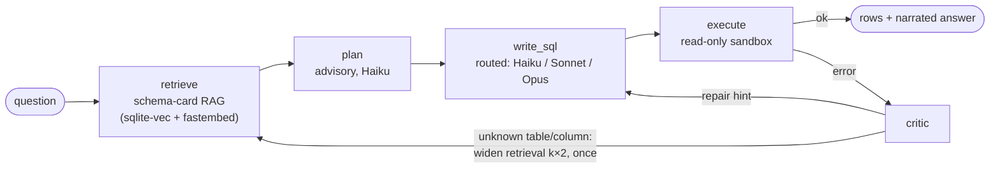

# QueryMate

**A multi-agent NL→SQL analytics copilot — and the eval harness that proves where it works *and* where it fails.**

[](https://github.com/isaacng924/querymate/actions/workflows/ci.yml)
[](pyproject.toml)
[](LICENSE)

Plain-English question → schema-grounded SQL → sandboxed execution → self-correcting
repair loop → narrated answer. Anyone can demo NL→SQL once; QueryMate's
differentiator is the **measurement around it**: execution accuracy on a public
benchmark (BIRD), a quantified self-correction lift, a red-teamed read-only trust
boundary, and a CI gate that blocks regressions.

```text
$ uv run querymate "Which customer has placed the most orders? Return their name."

SQL:
SELECT c.name FROM customers c JOIN orders o ON o.customer_id = c.id
GROUP BY c.id ORDER BY COUNT(*) DESC LIMIT 1

Result: name
  Alice

Answer: Alice has placed the most orders.

(1 row(s); repair attempts=0; writer=claude-haiku-4-5; cost=$0.0021)
```

## How it works



| Stage | Module | What it does |
|---|---|---|
| **retrieve** | `querymate/retriever.py` | Schema-card RAG: per-table cards embedded locally (fastembed `bge-small-en-v1.5`, no API key) into **sqlite-vec**, KNN per database + FK 1-hop expansion so join paths survive |
| **plan** | `querymate/llm.py` | One Haiku call sketches tables / joins / aggregations. Advisory — a failed plan never blocks the loop |
| **write_sql** | `querymate/llm.py` + `router.py` | Structured output, prompt caching on the schema prefix. **Routed for cost**: Haiku for simple lookups, Sonnet otherwise, Opus on the final repair attempt |
| **execute** | `validator.py` + `executor.py` | The **trust boundary**: sqlglot rejects anything that isn't a single read-only SELECT, then the query runs on a `mode=ro` SQLite connection with a timeout and row cap |
| **critic** | `querymate/nodes.py` | Feeds the structured DB error back as a repair hint — and on *unknown table/column*, **re-retrieves with a wider k** instead of just re-prompting |
| **explain** | `querymate/llm.py` | Narrates the result rows in 1–2 sentences; an **LLM-as-judge** scores whether the narration only states what the rows support |

Every LLM call logs model, tokens, cost, and latency into the run's `cost_log` —
cost per question by routing tier is a first-class eval metric.

## What gets measured

| Metric | How | Status |
|---|---|---|
| Execution accuracy (EX), by difficulty bucket | BIRD dev set, two arms (RAG vs full-schema) | harness ready — first benchmark run pending |
| Self-correction lift | EX with the critic loop vs single-shot | harness ready |
| Schema-retrieval recall@k | gold tables (sqlglot) vs retrieved top-k — LLM-free, runs on the full 1,534-question dev set for free | harness ready |
| Answer faithfulness | LLM-as-judge over the narration | harness ready |
| Safety pass-rate | 29-attack red-team corpus vs the trust boundary | **100% blocked, enforced in CI** |
| Cost / question | per-call accounting, broken out by routing tier | live |

## Quickstart

```bash
git clone https://github.com/isaacng924/querymate && cd querymate
uv sync
uv run python scripts/make_demo_db.py            # tiny deterministic demo store
for t in tests/test_*.py; do uv run python "$t"; done   # 68 tests, no API key needed
```

To actually ask questions (needs an Anthropic API key):

```bash
cp .env.example .env                             # put ANTHROPIC_API_KEY in it
uv run python scripts/ingest_schemas.py --demo   # build the demo schema index
uv run querymate "What was the total revenue in February 2026?"
```

`--no-rag` prompts with the full schema instead of retrieval; `--no-explain`
skips the answer narration.

## Evaluation

**Benchmark (BIRD dev):**

```bash
uv run python scripts/fetch_bird.py                          # ~1.2GB, one-time
uv run python scripts/ingest_schemas.py --db-root data/bird/dev_databases
uv run python evals/make_subset.py --dev data/bird/dev.json  # stratified 300 + smoke 30

uv run python evals/run_recall.py --subset data/bird/dev.json --ks 3 5 10   # free, no LLM
uv run python evals/run_bird.py --subset evals/data/bird_stratified.json --db-root data/bird/dev_databases --arm rag
uv run python evals/run_bird.py --subset evals/data/bird_stratified.json --db-root data/bird/dev_databases --arm full-schema
uv run python evals/make_chart.py evals/report_rag.json evals/report_full_schema.json
```

Reports include EX by difficulty bucket, the self-correction lift, retrieval
lift (RAG vs full-schema arm), and cost/question by routing tier.

**Regression gate (golden set):** a 40-question hand-written golden set on the
demo DB — business terms, ambiguous phrasings, negations, multi-step joins —
gated against a committed baseline:

```bash
uv run python evals/run_golden.py                    # EX + faithfulness + cost
uv run python evals/run_golden.py --update-baseline  # refresh evals/baseline.json (commit it)
uv run python evals/run_golden.py --gate             # exit 1 if EX drops >2pp or cost/question rises >15%
```

## Safety

Defence in depth, red-teamed in CI on every push:

1. **Static validator** (`sqlglot`): single statement, read-only roots only,
   forbidden-node walk — kills DML/DDL, stacked statements, comment smuggling,
   CTE- and UNION-wrapped writes, PRAGMA/ATTACH.
2. **Sandboxed executor**: `mode=ro` SQLite connection (the engine itself
   refuses writes), wall-clock timeout, row cap, no extension loading.
3. **Red-team corpus** (`evals/data/redteam_corpus.json`): 29 attacks across
   8 categories; the suite asserts a **100% block rate** and fails the build
   otherwise.

## CI

- **Tier 1 — every push, free** (`ci.yml`): all 11 plain-assert suites (68
  tests) including the red-team corpus and golden-set integrity. No API key,
  no model downloads, ~1 minute.
- **Tier 2 — manual** (`eval-gate.yml`, `workflow_dispatch`): runs the golden
  set with live LLM calls and blocks on EX/cost regression vs the committed
  baseline. Spend is deliberate, never per-push.

## Configuration

Everything overridable via env (prefix `QUERYMATE_`) or `.env` — see
`querymate/settings.py`:

| Variable | Default | Purpose |
|---|---|---|
| `QUERYMATE_WRITER_MODEL` | `claude-sonnet-4-6` | default writer/repair model |
| `QUERYMATE_FAST_MODEL` | `claude-haiku-4-5` | simple-lookup writer tier + explainer |
| `QUERYMATE_PLANNER_MODEL` | `claude-haiku-4-5` | advisory plan call |
| `QUERYMATE_ESCALATE_MODEL` | `claude-opus-4-8` | final repair attempt |
| `QUERYMATE_MAX_ATTEMPTS` | `3` | repair attempts after the first write |
| `QUERYMATE_RETRIEVAL_K` | `5` | schema cards retrieved per question |
| `QUERYMATE_STATEMENT_TIMEOUT_S` | `10.0` | executor wall-clock timeout |
| `QUERYMATE_MAX_ROWS` | `5000` | hard fetch cap |

## Project structure

```text
querymate/   the agent loop — validator · executor · llm · nodes · graph · router
             retriever · card_index · schema_cards · embedder · cli · settings · state
evals/       the harness — run_bird (EX) · run_recall (recall@k) · run_golden (gate)
             compare · recall · make_subset · make_chart · data/ (golden set, red-team corpus)
scripts/     make_demo_db · ingest_schemas · fetch_bird
tests/       11 plain-assert suites, 68 tests — all runnable standalone, no key needed
```

## Roadmap

- [x] **Phase 0** — writer → executor → critic loop, trust boundary, EX comparator
- [x] **Phase 1** — schema-card RAG, planner, model routing + cost accounting, retrieval-aware repair, two-arm BIRD harness
- [x] **Phase 2** — red-team suite, golden set, LLM-as-judge faithfulness, CI regression gate
- [ ] First published BIRD numbers (EX by bucket + self-correction lift + retrieval lift)
- [ ] **Phase 3** — Langfuse tracing + prompt registry, chat UI with feedback capture → golden set
- [ ] **Phase 4** — semantic layer, Spider 2.0, multi-DB

## Troubleshooting

`enable_load_extension` AttributeError → your Python build lacks SQLite
extension support; use a uv-managed interpreter (`uv python install 3.13 && uv sync`).

## Contributing

Issues and PRs welcome. Run the tier-1 suite before pushing
(`for t in tests/test_*.py; do uv run python "$t"; done`) — CI enforces it,
including the 100% red-team block rate.

## License

[MIT](LICENSE)
